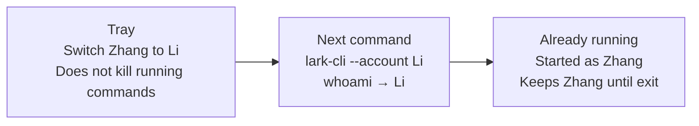

# lark-switch

**Unofficial · not affiliated with ByteDance / Feishu / Lark.**

The identity layer for the official Feishu / Lark CLI: it switches **people**, not apps. A tray for humans; one-shot identity for agents.

[](LICENSE)
[](https://github.com/larkswitch/lark-switch/releases/latest)
[](https://github.com/larkswitch/lark-switch/releases/latest)

Official `lark-cli --profile` manages an **App configuration**, not "the person". Multiple users under one App, isolated from each other, switchable at any time — that is why larkswitch exists.

It never stores Access Tokens or Refresh Tokens and does not reimplement Lark business APIs: OAuth, refresh and the OS keychain stay with official [`lark-cli`](https://github.com/larksuite/cli). larkswitch only isolates each `(App, User)` into its own config directory and decides who the next command runs as.



## Installation

| Platform | Form factor | Download |
| --- | --- | --- |
| Windows 10/11 x64 | Desktop app (tray + CLI) | [releases/latest](https://github.com/larkswitch/lark-switch/releases/latest) |
| macOS Intel / Apple Silicon | Desktop app (tray + CLI) | [releases/latest](https://github.com/larkswitch/lark-switch/releases/latest) |
| Linux x64 | CLI + shim (no tray) | [releases/latest](https://github.com/larkswitch/lark-switch/releases/latest) |

> **Unsigned alpha**: the installers are not code-signed, so Windows SmartScreen / macOS Gatekeeper may block them — that is **expected**, not a sign of tampering. See the [FAQ](#faq) for how to allow them. No Node.js / npm required; `setup` downloads and verifies the official CLI for you.

## 30-second quickstart

The control-plane command is `larkswitch` (`lpcctl` is a compatibility alias). If you already logged in with the official `lark-cli`:

```bash
larkswitch setup          # init: download & verify official lark-cli, install the shim. PATH untouched by default
larkswitch import         # absorb the existing ~/.lark-cli config as your first person
larkswitch account list   # see who is here
```

Then pick one:

- **Humans**: open the desktop app and switch from the tray (or `larkswitch account switch <uuid>` for a persistent switch);
- **Terminal / agents**: run a single command as one person, without touching the global active:

```bash
lark-cli --account alias:zhangsan whoami
```

If you want a plain `lark-cli` in your terminal to route through this product, turn PATH takeover on explicitly:

```bash
larkswitch setup --path-takeover
```

## For agents: one identity per command

Hand [`skills/larkswitch/SKILL.md`](skills/larkswitch/SKILL.md) to Cursor / Claude Code / Codex. Three rules: resolve first, then run; pick people with `--account`; never pick a person with official `--profile` — that is an App configuration, not "the person".

```bash
larkswitch account search --q "Zhang"       # loose lookup
larkswitch account resolve 'alias:zhangsan' # strict: 0 or multiple matches error out, never guess
lark-cli --account alias:zhangsan whoami    # one-shot execution
```

Selector grammar (`resolve` and `--account` are identical; `search` is loose):

- `id:<uuid>`, `alias:<alias>`
- bare value: full UUID → exact alias → exact and unique displayName
- App-scoped: `app:<appId or unique label>/<identity>`
- no match → `LPC_ACCOUNT_NOT_FOUND`; multiple matches → `LPC_ACCOUNT_AMBIGUOUS`

Precedence: leading `--account` (compat `--lpc-account`) > env `LARKSWITCH_ACCOUNT` (compat `LPC_ACCOUNT`) > current active. Only a leading run of argv is consumed; anything mid-argv or after `--` passes through to the official CLI untouched. Official `--profile` is never hijacked and passes through as-is.

## Highlights

- **One App, many people**: each `(App, User)` gets an isolated config directory; multiple accounts under one App never pollute each other.
- **In-flight commands never change identity**: the identity is snapshotted when a command starts; tray switching only affects the **next** command.
- **Tokens never touched**: no Access / Refresh Token storage; OAuth and the keychain stay with official lark-cli — see [docs/SECURITY.md](docs/SECURITY.md).
- **PATH takeover off by default**: your existing `lark-cli` is untouched unless you explicitly pass `--path-takeover`.

## FAQ

### How is this different from official `--profile`?

An official Profile is an **App configuration**: since v1.0.5 it can manage multiple Apps, but a single App ID still holds exactly one identity. larkswitch uses the officially supported `LARKSUITE_CLI_CONFIG_DIR` to give each account its own config directory, so one App can hold multiple people. App Secrets still live in the OS keychain via the official CLI, and user tokens are still managed by the official CLI per `(App ID, User Open ID)`.

### The installer is blocked by the OS?

Expected for an unsigned alpha. Windows: SmartScreen → "More info" → "Run anyway". macOS: right-click the package and choose "Open", or allow it in System Settings.

### Why is there no tray on Linux?

The Linux release ships CLI + shim: every control-plane command and the identity isolation work; the desktop tray is planned later.

### Where do state and backups live?

The state directory is decided by `LPC_HOME` (platform user-data directory when unset). The desktop app takes a file-level backup at startup and then every 6 hours into `LarkProfileConsoleBackups` under your Documents folder; deleting the program directory does not touch backups.

## Build from source

CLI and shim (Rust):

```bash
cargo build --release -p lpcctl -p lpc-shim
# artifacts: larkswitch (control plane) and lark-cli (shim)
target/release/larkswitch setup --shim target/release/lark-cli
```

Desktop app (Tauri v2, under `apps/desktop`, requires pnpm):

```bash
pnpm install
pnpm tauri build
```

Release artifacts are produced by the CI three-platform matrix; a local build is fine for daily use.

## `larkswitch` command reference

`lpcctl` is a compatibility alias for `larkswitch` — the same control plane. Frequently used subcommands:

| Command | What it does |
| --- | --- |
| `larkswitch setup` | Initialize: install official CLI + shim (`--cli-version` pins a version, `--shim` points at the shim source, `--path-takeover` enables PATH takeover) |
| `larkswitch import` | Import an existing `~/.lark-cli` (or `--config-dir`) config as accounts |
| `larkswitch runtime install` / `larkswitch runtime rollback` / `larkswitch runtime list` | Install / roll back / list official CLI versions |
| `larkswitch app import` | Import an App with an existing App ID + Secret (`--secret-stdin` reads the secret from a pipe, not a terminal prompt) |
| `larkswitch app import-config` | Import an App from an official config directory (`--label`, `--config-dir`) |
| `larkswitch app create` | Create an App through the official interactive flow |
| `larkswitch app list` / `larkswitch app remove` | List Apps / remove App metadata (official keychain untouched) |
| `larkswitch app refresh-scopes` / `larkswitch app policy-all` / `larkswitch app policy-set` | Read live `userScopes` / set them all as the stable policy / set a policy manually (`--scopes a,b,c`) |
| `larkswitch account login` / `larkswitch account reauthorize` | Add an account under an App / re-authorize an existing one (official OAuth page) |
| `larkswitch account discover-configs` / `larkswitch account import-config` | Scan / import logged-in official config directories |
| `larkswitch account list` / `larkswitch account search` | Compact account list (`--with-scopes`); loose search (`--q` keyword, `--app`, `--health`, `--scope`) |
| `larkswitch account resolve` | Strictly resolve a unique account, same rules as `--account` |
| `larkswitch account alias set` / `larkswitch account alias clear` | Set / clear an account alias |
| `larkswitch account switch` / `larkswitch account check` / `larkswitch account remove` | Persistent switch / health check / remove an account and its isolated directory |
| `larkswitch path install` / `larkswitch path repair` / `larkswitch path remove` | Install / repair PATH takeover (`--takeover-npm` also replaces the global npm entry) / undo |
| `larkswitch snapshot` | Full JSON snapshot of accounts / Apps / in-flight commands |
| `larkswitch ps` | List lark-cli commands currently holding identity leases |
| `larkswitch doctor` | Local self-checks (`--share` emits a redacted report safe to paste) |
| `larkswitch backup` / `larkswitch restore` | Manual backup / restore (`--list` lists snapshots, `--snapshot <id>` restores a specific one, neither restores the newest) |

Recommended way to import an existing App (keeps the secret out of terminal history):

```bash
printf '%s\n' "$LARK_APP_SECRET" | \
  larkswitch app import \
  --label "Company Feishu" \
  --app-id "$LARK_APP_ID" \
  --secret-stdin
```

The security model (tokens never touched, secrets only transient in memory, backup policy) is detailed in [docs/SECURITY.md](docs/SECURITY.md).

## Docs & license

- [Product definition](docs/PRODUCT.md)
- [Architecture](docs/ARCHITECTURE.md)
- [Security model](docs/SECURITY.md)
- [Testing & release gates](docs/TESTING.md)
- [Manual end-to-end testing](docs/MANUAL-E2E.md)
- [Release process](docs/RELEASE.md)
- [中文 README](README.md)

License: [MIT](LICENSE)