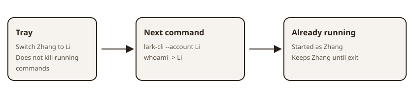

# larkswitch

**Unofficial · not affiliated with ByteDance / Feishu / Lark.**

飞书 / Lark 官方 CLI 的身份层：切的是**人**，不是 App。人类用托盘换人，Agent 每条命令指定一次身份。

[](LICENSE)
[](https://github.com/larkswitch/larkswitch/releases/latest)
[](https://github.com/larkswitch/larkswitch/releases/latest)

官方 `lark-cli --profile` 管的是 **App 配置**，不是「这个人」。同一个 App 下挂多个人、互不污染、随时换人——这是 larkswitch 存在的理由。

它不保存 Access Token / Refresh Token，也不重写飞书业务 API：OAuth、刷新和钥匙串全部留在官方 [`lark-cli`](https://github.com/larksuite/cli)。larkswitch 只把每个 `(App, User)` 隔离成独立配置目录，并决定下一条命令用谁。



## 安装

| 平台 | 形态 | 下载 |
| --- | --- | --- |
| Windows 10/11 x64 | 桌面端（托盘 + CLI） | [releases/latest](https://github.com/larkswitch/larkswitch/releases/latest) |
| macOS Intel / Apple Silicon | 桌面端（托盘 + CLI） | [releases/latest](https://github.com/larkswitch/larkswitch/releases/latest) |
| Linux x64 | CLI + Shim（无托盘） | [releases/latest](https://github.com/larkswitch/larkswitch/releases/latest) |

> **未签名 Alpha**：安装包没有代码签名，Windows SmartScreen / macOS Gatekeeper 可能拦截——这是**预期行为**，不是安装包被篡改。放行方法见 [FAQ](#faq)。不需要预装 Node.js / npm，`setup` 会自动下载并校验官方 CLI。

## 30 秒上手

控制面命令叫 `larkswitch`（`lpcctl` 是兼容别名）。已有官方 `lark-cli` 登录的话：

```bash
larkswitch setup          # 初始化：下载并校验官方 lark-cli，安装 Shim。默认不改 PATH
larkswitch import         # 把已有 ~/.lark-cli 配置收编为第一个人
larkswitch account list   # 看看现在有谁
```

然后二选一：

- **人类**：打开桌面端，托盘点一下换人（或 `larkswitch account switch <uuid>` 持久切换）；
- **终端 / Agent**：单次指定身份执行，不动全局 active：

```bash
lark-cli --account alias:zhangsan whoami
```

需要人类在终端直接敲 `lark-cli` 就走本产品时，再显式打开 PATH 接管：

```bash
larkswitch setup --path-takeover
```

## 给 Agent：一次一身份

把 [`skills/larkswitch/SKILL.md`](skills/larkswitch/SKILL.md) 交给 Cursor / Claude Code / Codex。规则只有三条：先解析、后执行；用 `--account` 选人；绝不用官方 `--profile` 选人——那是 App 配置，不是「这个人」。

```bash
larkswitch account search --q "张三"           # 宽松找人
larkswitch account resolve 'alias:zhangsan'   # 严格解析：0 个或多个匹配都报错，绝不猜
lark-cli --account alias:zhangsan whoami      # 单次执行
```

Selector 规则（`resolve` 与 `--account` 完全一致；`search` 宽松）：

- `id:<uuid>`、`alias:<alias>`
- 裸值：完整 UUID → 精确 alias → 精确且唯一的 displayName
- App 限定：`app:<appId或唯一label>/<identity>`
- 找不到报 `LPC_ACCOUNT_NOT_FOUND`；多个匹配报 `LPC_ACCOUNT_AMBIGUOUS`

优先级：命令开头 `--account`（兼容 `--lpc-account`）> 环境变量 `LARKSWITCH_ACCOUNT`（兼容 `LPC_ACCOUNT`）> 当前 active。只吃 argv 开头连续段，中途或 `--` 之后的参数原样透传官方 CLI；官方 `--profile` 不劫持、原样透传。

## Highlights

- **一个 App，多个人**：每个 `(App, User)` 一个隔离配置目录，同一 App 下多账号互不污染。
- **正在跑的命令不被换脸**：命令启动时冻结身份快照，托盘切人只影响**下一次**命令。
- **Token 不经手**：不保存 Access / Refresh Token，OAuth 与钥匙串归官方 lark-cli，详见 [docs/SECURITY.md](docs/SECURITY.md)。
- **PATH 接管默认关闭**：不碰你现有的 `lark-cli`，要接管必须显式 `--path-takeover`。

## FAQ

### 和官方 `--profile` 有什么区别？

官方 Profile 是 **App 配置**：v1.0.5 起可以管多个 App，但同一 App ID 下永远只有一套身份。larkswitch 用官方支持的 `LARKSUITE_CLI_CONFIG_DIR`，为每个账号建立独立配置目录，让同一 App 下挂多个人。App Secret 仍由官方 CLI 放入系统钥匙串，用户 Token 仍由官方 CLI 按 `(App ID, User Open ID)` 管理。

### 安装包被系统拦截了？

未签名 Alpha 的预期行为。Windows：SmartScreen 选「更多信息 → 仍要运行」；macOS：右键安装包选「打开」，或在系统设置里允许。

### Linux 为什么没有托盘？

Linux 的发布产物是 CLI + Shim：控制面命令与身份隔离全部可用，桌面托盘后置支持。

### 状态和备份放在哪？

状态目录由 `LPC_HOME` 决定（未设置时用各平台用户数据目录）。桌面端启动时做一次文件级备份，之后每 6 小时自动备份到用户文档目录的 `LarkProfileConsoleBackups`；删除程序目录不影响备份。

## 从源码构建

CLI 与 Shim（Rust）：

```bash
cargo build --release -p lpcctl -p lpc-shim
# 产物：larkswitch（控制面）与 lark-cli（Shim）
target/release/larkswitch setup --shim target/release/lark-cli
```

桌面端（Tauri v2，在 `apps/desktop` 下，需要 pnpm）：

```bash
pnpm install
pnpm tauri build
```

发布产物由 CI 三平台矩阵产出，本地构建即可日常使用。

## `larkswitch` 命令参考

`lpcctl` 是 `larkswitch` 的兼容别名，同一控制面。常用子命令：

| 命令 | 作用 |
| --- | --- |
| `larkswitch setup` | 初始化：装官方 CLI + Shim（`--cli-version` 指定版本、`--shim` 指定 Shim 源、`--path-takeover` 打开 PATH 接管） |
| `larkswitch import` | 从 `~/.lark-cli`（或 `--config-dir`）导入已有配置为账号 |
| `larkswitch runtime install` / `larkswitch runtime rollback` / `larkswitch runtime list` | 安装 / 回滚 / 列出官方 CLI 版本 |
| `larkswitch app import` | 用已有 App ID + Secret 导入 App（`--secret-stdin` 从管道读 Secret，不走终端提示） |
| `larkswitch app import-config` | 从官方配置目录导入 App（`--label`、`--config-dir`） |
| `larkswitch app create` | 走官方交互流程新建 App |
| `larkswitch app list` / `larkswitch app remove` | 列出 App / 删除 App 本地元数据（不动官方钥匙串） |
| `larkswitch app refresh-scopes` / `larkswitch app policy-all` / `larkswitch app policy-set` | 读取实时 `userScopes` / 全量设为稳定策略 / 手工指定策略（`--scopes a,b,c`） |
| `larkswitch account login` / `larkswitch account reauthorize` | 在 App 下新增账号 / 对已有账号重新授权（官方 OAuth 页面） |
| `larkswitch account discover-configs` / `larkswitch account import-config` | 扫描 / 导入已登录的官方配置目录 |
| `larkswitch account list` / `larkswitch account search` | 紧凑账号列表（`--with-scopes`）；宽松搜索（`--q` 关键词、`--app`、`--health`、`--scope`） |
| `larkswitch account resolve` | 严格解析唯一账号，规则同 `--account` |
| `larkswitch account alias set` / `larkswitch account alias clear` | 设置 / 清除账号别名 |
| `larkswitch account switch` / `larkswitch account check` / `larkswitch account remove` | 持久切换 / 健康体检 / 删除账号及隔离目录 |
| `larkswitch path install` / `larkswitch path repair` / `larkswitch path remove` | PATH 接管安装 / 修复（`--takeover-npm` 才会替换全局 npm 入口）/ 撤销 |
| `larkswitch snapshot` | 输出账号 / App / 运行中命令的完整快照 JSON |
| `larkswitch ps` | 列出正在持有身份租约的 lark-cli 命令 |
| `larkswitch doctor` | 环境自检（`--share` 输出可外发的脱敏报告） |
| `larkswitch backup` / `larkswitch restore` | 手工备份 / 恢复（`--list` 只列快照、`--snapshot <id>` 恢复指定快照，都不给则恢复最新） |

导入已有 App 的推荐姿势（Secret 不进终端历史）：

```bash
printf '%s\n' "$LARK_APP_SECRET" | \
  larkswitch app import \
  --label "公司飞书" \
  --app-id "$LARK_APP_ID" \
  --secret-stdin
```

安全模型（Token 不经手、Secret 只短暂经过内存、备份策略）详见 [docs/SECURITY.md](docs/SECURITY.md)。

## 文档与许可

- [产品定义](docs/PRODUCT.md)
- [技术架构](docs/ARCHITECTURE.md)
- [安全模型](docs/SECURITY.md)
- [测试与发布门禁](docs/TESTING.md)
- [人工端到端测试](docs/MANUAL-E2E.md)
- [发布流程](docs/RELEASE.md)
- [English README](README.en.md)

License: [MIT](LICENSE)